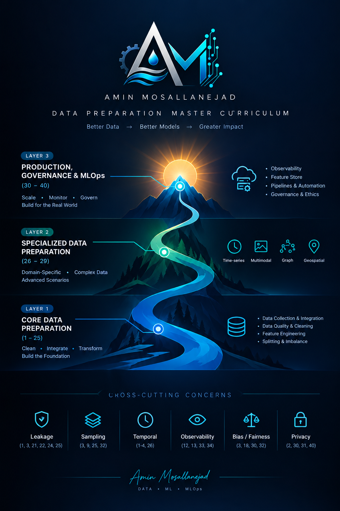

# 📘 Data Preparation — Master Curriculum

**Author:** [Amin Mosallanejad](https://github.com/AminMosallanejad339)  
**Version:** Final v1.0 · **Sections:** 41 · **Sub-sections:** ~420 · **Layers:** 3 + 1 Optional

---

## 🎯 Overview

A comprehensive, production-grade curriculum for **Data Preparation** — 
from foundational concepts to advanced, specialized, and MLOps-grade topics.

Built as a **reference** for Data Scientists, ML Engineers, and Data Engineers.

🌐 **[→ View Interactive Version](https://aminmosallanejad339.github.io/data-prep-curriculum/)**

---

## Structure

LAYER 1 — CORE DATA PREPARATION (Sections 1 – 25)
LAYER 2 — SPECIALIZED DATA PREPARATION (Sections 26 – 29)
LAYER 3 — PRODUCTION, GOVERNANCE & MLOps (Sections 30 – 40)
OPTIONAL — AI / LLM ERA SPECIALIZATION (Section 41)

text

### Cross-Cutting Concerns
Leakage ·  Sampling ·  Temporal ·  Observability ·  Bias/Fairness ·  Privacy

---

## Full Section List

### Layer 1 — Core (Sections 1–25)

| #    | Section                            |
| ---- | ---------------------------------- |
| 1    | Data Leakage Fundamentals          |
| 2    | Data Collection                    |
| 3    | Sampling & Dataset Construction    |
| 4    | Data Acquisition                   |
| 5    | Data Semantics & Metadata          |
| 6    | Data Integration                   |
| 7    | Entity Resolution & Record Linkage |
| 8    | Scalable / Big Data Processing     |
| 9    | Exploratory Data Analysis (EDA)    |
| 10   | Data Cleaning                      |
| 11   | Data Validation                    |
| 12   | Data Profiling                     |
| 13   | Data Quality Framework             |
| 14   | Missing Value Handling             |
| 15   | Outlier Detection                  |
| 16   | Outlier Treatment                  |
| 17   | Noise Reduction                    |
| 18   | Label Quality & Annotation         |
| 19   | Data Transformation (ML-Centric)   |
| 20   | Data Transformation (DE-Centric)   |
| 21   | Feature Engineering                |
| 22   | Feature Selection                  |
| 23   | Dimensionality Reduction           |
| 24   | Data Splitting                     |
| 25   | Imbalance Handling                 |

### Layer 2 — Specialized (Sections 26–29)

| #    | Section                          |
| ---- | -------------------------------- |
| 26   | Time-series Specific Preparation |
| 27   | Multimodal & Unstructured Data   |
| 28   | Graph / Network Data             |
| 29   | Geospatial Data                  |

### Layer 3 — Production & Governance (Sections 30–40)

| #    | Section                                    |
| ---- | ------------------------------------------ |
| 30   | Synthetic Data Generation                  |
| 31   | Data Privacy & Compliance                  |
| 32   | Bias & Fairness                            |
| 33   | Data Drift & Concept Drift                 |
| 34   | Data Observability                         |
| 35   | Data Documentation                         |
| 36   | Data Versioning & Lineage                  |
| 37   | Feature Store & Serving                    |
| 38   | End-to-End Pipeline & Automation           |
| 39   | Saving, Containerization & Reproducibility |
| 40   | Data Governance & Ethics                   |

###  Optional (Section 41)

| #    | Section                      |
| ---- | ---------------------------- |
| 41   | AI / LLM Dataset Preparation |

---

##  Study Tracks

| Track              | Sections                         | Duration | Audience              |
| ------------------ | -------------------------------- | -------- | --------------------- |
| 🟢 **Core**         | 1–25 (selected)                  | ~40h     | Beginner–Intermediate |
| 🟡 **Intermediate** | Core + 4,5,7,8,12,13,20,23,30–33 | ~80h     | Data Scientist        |
| 🔴 **Advanced**     | All + Specialized + 34–40        | ~120h+   | ML / MLOps Engineer   |
| 🟣 **LLM Track**    | 1, 3, 18, 27 + 41                | ~50h     | NLP / LLM Engineer    |

---

## 📄 Files

| File            | Description                            |
| --------------- | -------------------------------------- |
| `index.html`    | Interactive web version (GitHub Pages) |
| `curriculum.md` | Full Markdown reference                |
| `poster.png`    | Visual overview poster                 |
| `logo.png`      | Brand logo                             |

---

##  License

MIT — free to use, adapt, and share.

---

